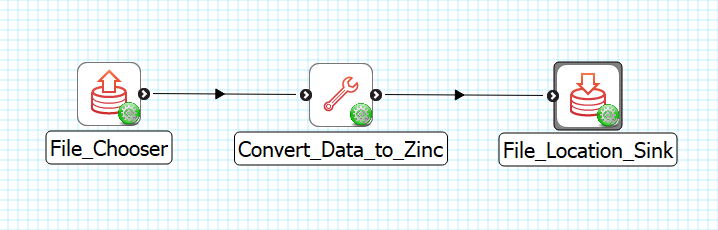
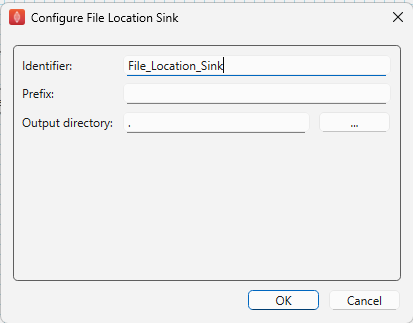

File Location Sink
==================

Overview
--------

The **File Location Sink** is MAP Client plugin for saving a file to a location outside the workflow.

Workflow Connections
--------------------

As shown in :numref:`fig-mcp-file-location-sink-workflow-connections`, the **File Location Sink** need 1 input.

1. A file that needs to be saved to local disk. (Port: *http://physiomeproject.org/workflow/1.0/rdf-schema#file_location*) 

It does not produce any output to the workflow, the output file will be saved to the selected location in the configuration.

.. _fig-mcp-file-location-sink-workflow-connections:

   **File Location Sink** workflow connections.

Configure
---------

This step is used for saving a file to the local disk outside the workflow directory.
This step uses a *http://physiomeproject.org/workflow/1.0/rdf-schema#file_location* to define the location where the file is saved.
To set the location to save the file to use the *...* button to open a file chooser dialog.
The *File* input is used to hold the relative path from the workflow to the output file location.

.. _fig-mcp-file-location-sink-configure-dialog:

   *File Location Sink* step configuration dialog.
